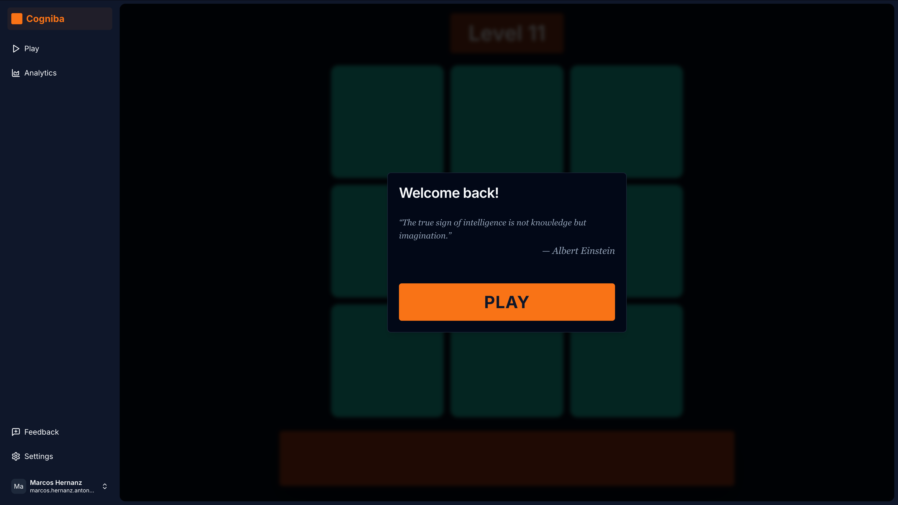

# Cogniba 🧠

**The only brain training that works.** A modern web platform for cognitive enhancement based on the scientifically validated Dual N-Back task.

### 🚀 Traction

- **2,000 Registered Users**
- **Scientific Foundation:** Implements the Jaeger Dual N-Back algorithm for working memory improvement.

### 🏗 Architecture

Built with performance and type-safety in mind using the modern T3-style stack.

- **Frontend:** Next.js (App Router) & React
- **Backend/Auth:** Supabase
- **Database ORM:** Drizzle ORM
- **Analytics:** PostHog
- **Styling:** Tailwind CSS + Shadcn UI

### 🛠 Tech Stack

### 🔗 Live Project

[Visit Cogniba.com](https://cogniba.com)
